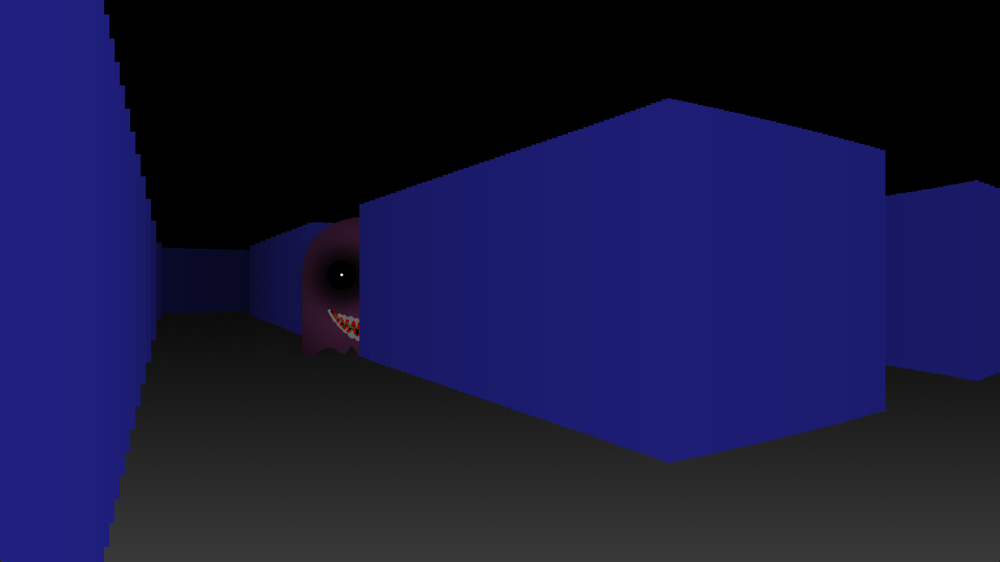
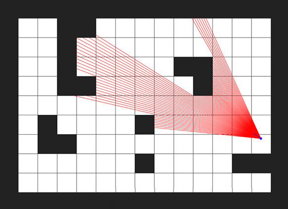

# PacMan.exe
This is a 3D horror game made with python. It uses [PyGame](https://www.pygame.org/) library and [Ray Casting](https://ru.wikipedia.org/wiki/Ray_casting) technology. I made it in one week. I would not mind if you tried it and appreciated





## Requirements
* Git
* Python 3.9
* Pip

## Installation
Create a new folder and open it in terminal

Then enter this command to clone my repository
```
git clone https://github.com/Olzeev/PacManExe.git
```
Go to 'PacMacExe' folder
```commandline
cd PacManExe
```
Also you may need to install some libraries:
```commandline
pip install pygame
pip install keyboard
```
Now you can start the game
```commandline
python3 main.py
```
or 
```
python main.py
```